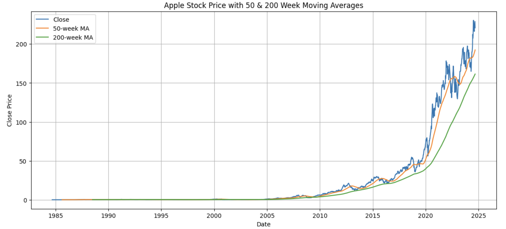
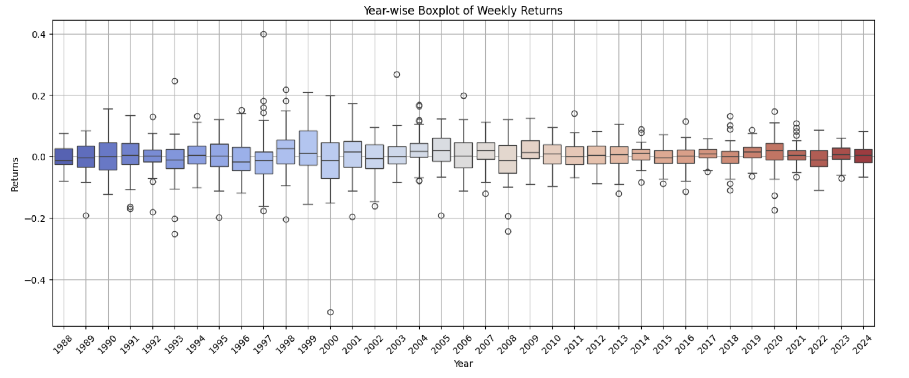
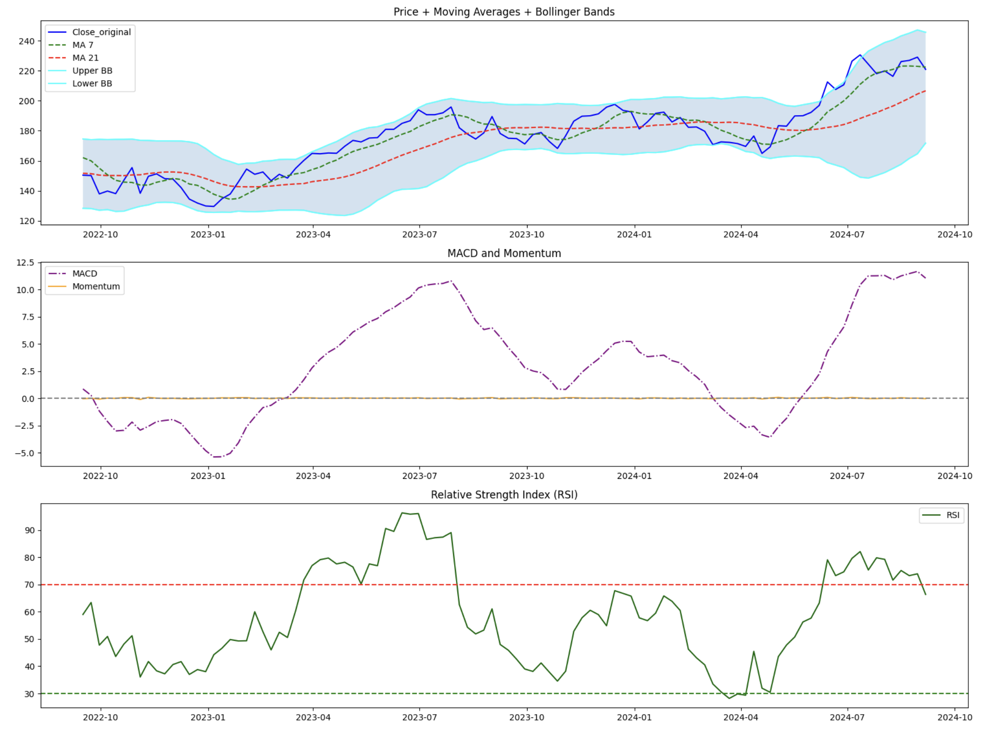
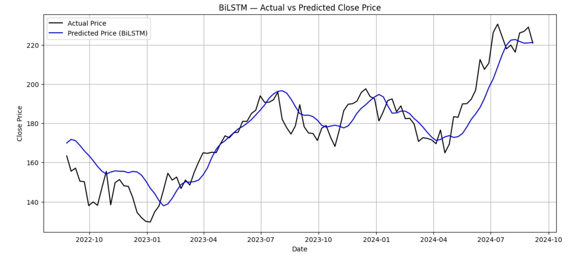
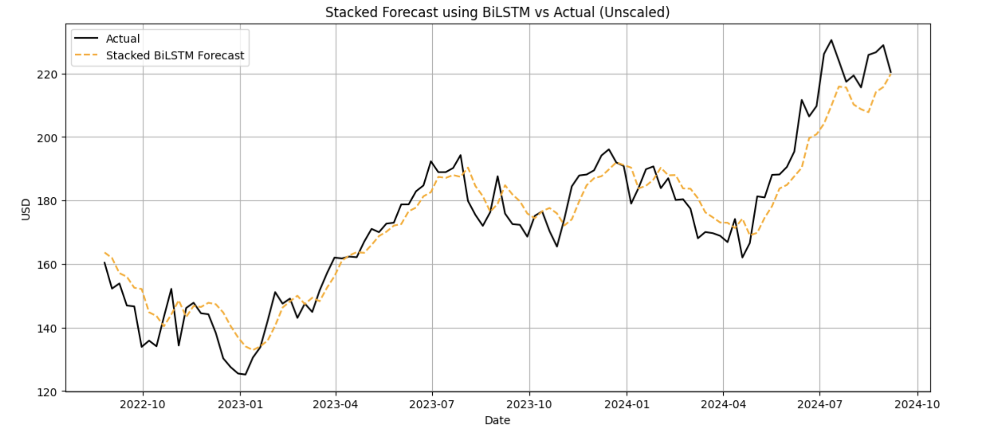

# 📈 Apple Stock Price Forecasting

This project builds a hybrid deep learning system to forecast stock prices using a combination of statistical and deep learning models. It blends ARIMA, Prophet, and BiLSTM models in a residual and stacked architecture to improve predictive accuracy over traditional methods.

---

## 🚀 Project Overview

We use Apple Inc.’s stock data from 1984–2025 and apply multiple time series forecasting techniques in a hybrid pipeline:
1. **ARIMA** – models trend and linear components
2. **Prophet** – models seasonality and holiday effects
3. **BiLSTM with Attention** – learns residuals and sequence patterns
4. **Stacked BiLSTM** – final prediction using all model outputs, residuals, and technical indicators

--- 

## 📘 Notebook Workflow Summary

1. EDA & Preprocessing
- Converted the Date column to datetime and set it as the index.
- Resampled data from daily to weekly to reduce noise and focus on long-term trends.
- Visualized trends, volatility, and moving averages to understand behavior.

2. Feature Engineering
- Computed multiple technical indicators:
    - Moving Averages (MA50, MA200, MA7, MA21)
    - EMA (12, 26), MACD, Momentum, RSI
    - Bollinger Bands (upper, lower, 20sd)
- Added Fourier features for cyclic pattern modeling.
- Created lag features (lag_1, lag_2, lag_3, etc.) for sequence learning.
- Added time-based features like Month, Week, Quarter, and Time_Index.

3. Classical Forecasting Models
- 🔹 ARIMA
    - Fitted an ARIMA model on the Close price to capture the linear trend component.
    - Stored ARIMA forecast as a separate feature.
- 🔹 Prophet (Facebook)
    - Fitted Prophet to model seasonality and event-driven shifts.
    - Stored Prophet forecast and residuals.

4. Residual Modeling with BiLSTM
- Trained BiLSTM on ARIMA and Prophet residuals to capture nonlinear components left unexplained.
- Added BiLSTM-corrected forecasts as improved residual-corrected predictions.

5. BiLSTM + Attention Forecasting
- Created sequence data for supervised learning using windowed past timesteps.
- Built a deep Bidirectional LSTM model with multi-layered architecture.
- Added a custom attention mechanism to assign importance to timesteps dynamically.
- Trained the model and evaluated using RMSE, MAE, MAPE, and R².
- Visualized attention weights, rolling residuals, and predictions vs. actuals.

6. Preparing Inputs for Stacked Model
- Collected and scaled ARIMA, Prophet, BiLSTM outputs and their residuals.
- Combined these with selected technical indicators (e.g., RSI, momentum, MACD) and Prepared input features as sequences for the stacked BiLSTM model.

7. Stacked BiLSTM Model
- Designed a second-stage BiLSTM using model outputs and indicators as input.
- Tuned architecture and hyperparameters using Optuna.
- Trained on full sequence data to improve accuracy using ensemble of ARIMA + Prophet + BiLSTM.

8. Final Evaluation & Forecasting
- Evaluated all models using:
    - MAE, RMSE, MAPE, R²
- Visualized:
    - Actual vs Predicted (Train/Test/Zoomed)
    - Residuals over time
- Forecasted price on a specific date using the trained model.

---

## 📈 Performance Metrics

| Metric | BiLSTM Model | Stacked Model              |
|--------|--------------|----------------------------|
| **MAE**   | 0.0350    | 6.1186                     |
| **RMSE**  | 0.0447    | 7.6693                     |
| **MAPE**  | 4.82%     | 0.0351%                    |
| **R²**    | 0.8207    | 0.9008                     |


---

## 📉 Forecasting Example
```bash
📅 Date: 2023-09-03
✅ Real Price     : ₹183.25
📈 Predicted Price: ₹182.61
```

---

## 📦 Installation

1. Clone the Repository
```bash
git clone https://github.com/AksharKher-30/stock-price-prediction.git
cd stock-price-prediction
```

2. Install Dependencies
```bash
pip install -r requirements.txt
```

3. Running the Notebook
```bash
jupyter notebook Apple_Stock_Forecasting.ipynb
```
> This will open the Jupyter interface in your browser.

---

## Visualizations

| 50 & 200-Day Moving Average          | Fourier components                   |
|--------------------------------------|--------------------------------------|
|  |  |

| Year-wise Boxplot of Weekly Returns  | Price + Moving Averages + Bollinger Bands, MACD and Momentum, Relative Strength Index (RSI)   |
|--------------------------------------|--------------------------------------|
|  |  |

| BiLstm (with attemtion mechanism)        | Stacked Bilstm (ARIMA + Propeht + Bilstm residual)                  |
|--------------------------------------|--------------------------------------|
|  |  |

---

## 📌 Key Learnings

- Combining classical + deep models boosts robustness and performance.
- Residual learning adds corrective layers to underfitted models like ARIMA.
- Attention mechanisms help interpret time dependency in BiLSTM.
- Proper scaling and lag features significantly impact model accuracy.

---

## 🙌 Contribute & Feedback

Feel free to explore this repository to understand how the complete pipeline—from classical forecasting models to advanced deep learning architectures—has been implemented and integrated. This project demonstrates hybrid modeling, residual correction, attention-based BiLSTM, and final stacked forecasting in a structured and reproducible way.

If you found this project helpful or insightful:
- ⭐ Give it a star to support the work.
- 🐛 Open an issue if you encounter any bugs or have improvement ideas.
- 💬 Feedback and contributions are always welcome to help improve the work further